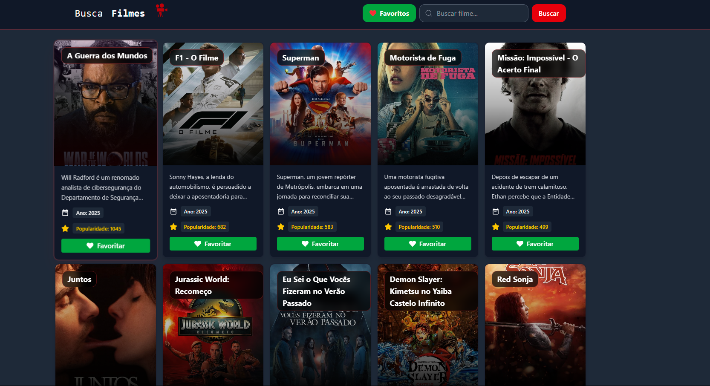
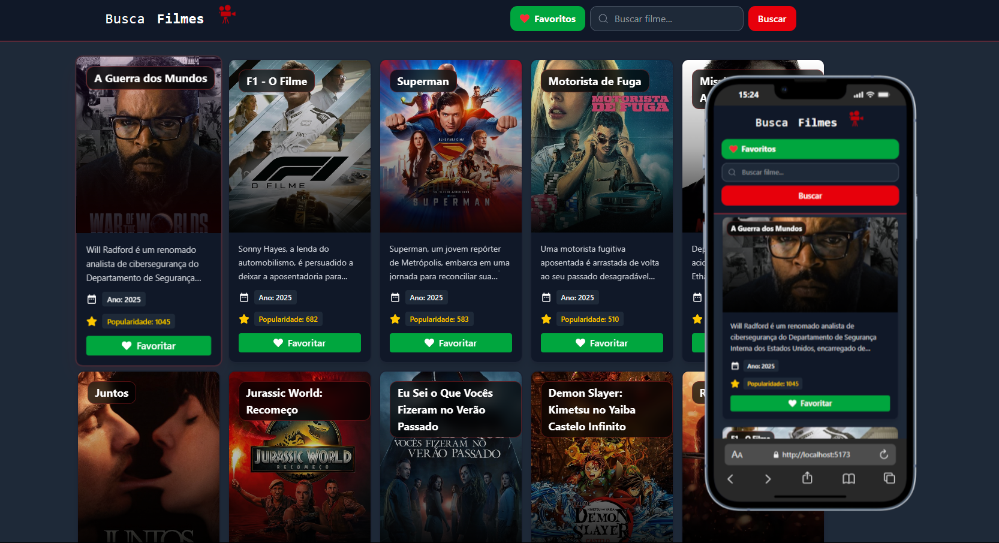

# Consumo de API com ReactJS | LISTA 05 – +Prati & Codifica
##   Descrição do Exercício!
Este projeto foi desenvolvido como parte de um exercício prático das empresas +PRATI junto com a Codifica para consolidar conhecimentos em **REACT**

1. Você deverá criar uma aplicação em React que consuma a API do TMDB (ou OMDb) para permitir que usuários busquem filmes, vejam detalhes e montem uma lista de favoritos.




## Demostração do Layout   []()




## Como Utilizar 

1. **Clone o Repositório**

```bash
 git clone ENDEREÇO REPOSITÓRIO

```
2. **Rodar**
- Entrar na pasta raiz utilizando terminal !
```bash
cd PASTA

 npm install
 
 npm run dev
```


## Tecnologias Utilizadas 

1.React 

2.TailWind 

## Autor

[Abreeu](https://www.linkedin.com/in/abreeu/)


## Licença

Este projeto está sob a licença MIT. Você é livre para usá-lo como quiser, tanto para uso pessoal quanto comercial.


